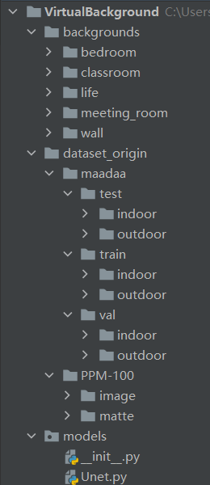
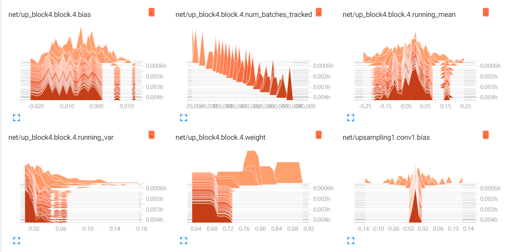
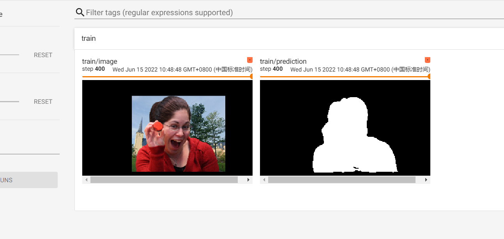
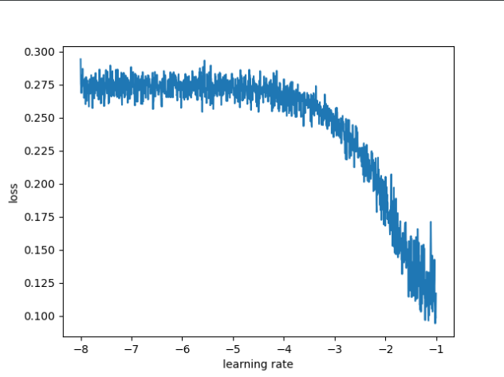
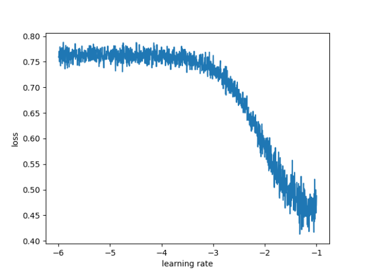

# Virtual Background
这是模式识别课程设计的核心内容。这个项目将通过复现UNet论文的形式来实现虚拟背景的功能，然后自己可以做出一个还行的效果。

## 数据集
1. 马达智数与CVPR2021 workshop合作的竞赛：https://maadaa.ai/cvpr2021-human-centric-video-matting-challenge/
2. [ModNet](https://github.com/ZHKKKe/MODNet)使用的数据：[PPM-100](https://github.com/ZHKKKe/PPM#download)
3. MODNet提及的[Adobe Matting Dataset](https://sites.google.com/view/deepimagematting): 未能收集到，他们要求邮件联系

## 工程运行

首先将上述用到的数据先放置在`dataset_origin`. 下载好的两个数据放置成如下结构（因为opencv只支持中文，所以下载的马达智数的数据需要手动将中文文件夹名改成英文）：

然后在百度图片上收集一些可能用到的图片放置到backgrounds文件夹下，这里考虑这几个场景：
1. `meeting_room`: 可能在会议室里开远程会议，比如两个公司的人在各自的会议室里，两拨人参加一个远程会议；
2. `bedroom`: 有人在家在卧室甚至床上开远程会议或上课；
3. `classroom`: 在课室使用；
4. `wall`: 有人在家用，刚好背后是家里的墙或一些墙上的摆件；
5. `life`: 户外各种场景使用。

工程代码执行顺序：
1. `data_split.py`: 切分数据集，保证到时测试集的图片和特征尽可能少地出现在训练集中，另外是因为马达智数的验证集文件夹里没有标签，根本没法用；
2. `data_expansion.py`: 这是为了扩充数据集，就像Adobe Matting Dataset和MODNet一样，通过背景合成的方式来得到足够规模的数据集。

## 代码说明

### data_split.py

此脚本用于切分数据集，需要修改验证集的比例可以修改maadaa_split_ratio和PPM_split_ratio.

鉴于PPM-100数据集只有100张图片，而且图片质量、标注质量都是PPM质量更高，人物姿态等都更加多样化，比较有利于 神经网络的特征学习，所以PPM-100将是核心的数据，背景合成扩充数据也将是主力数据，因此让他多一些作为训练集（90\%作为训练集）。本 项目的实测效果更重要，而训练集的特征多样化是关键。

## 一些问题记录

### 问题1 标注信息缺失
在执行`data_split.py`时，出现了

    FileNotFoundError: [Errno 2] No such file or directory: 'dataset_origin\\maadaa\\train\\indoor\\laptop_a0199_indoor\\laptop_a0199_indoor_0012.png' 

的问题。然后经过排查，发现这个视频在倒数的那几帧做了第一帧标注，后面它突然就不标注了。于是还是要做一个检查mask是否有匹配的文件才行。

### 问题2 背景合成中的前景特征问题

合成用的背景，在PPM数据集的合成中，几乎都用掉了，这样子的话，会不会特征过拟合，不过想了下，因为背景会变化成前景的size,而前景什么大小都有，所以背景的特征也会变成各种各样的分辨率比例，应该不用太担心。

### 问题3 Logger被意外中止时是否能够保住日志

已实验，可以。

## 一些资料记录

### TensorBoard

https://blog.csdn.net/qq_45488242/article/details/122787702

https://zhuanlan.zhihu.com/p/469849842

https://blog.csdn.net/weixin_53598445/article/details/121301078

### pytorch模型保存

https://blog.csdn.net/Obolicaca/article/details/123598171

### find_lr

https://blog.csdn.net/u010087338/article/details/122949354

### 疑似过拟合

在下面的实验记录中，出现了非常严重的过拟合。

但是经过排除以下可能问题：

1. 模型验证前没有使用model.eval()
2. 验证集输入没有归一化到与训练集同样的分布
3. 验证代码逻辑错误
4. 验证集数据相差很大
5. 验证集预处理相差很大

最后将训练集作为验证集来计算val loss, 仍然出现了val loss非常大，IoU非常小的问题，但是关闭model.eval()后，就恢复正常了，之后关闭model.eval(),正常的用验证集来验证也没有那么严重的过拟合了。 

经过百度“pytorch model.eval后准确率很低”后发现了很多人也有这个问题：
1. https://www.w3cschool.cn/article/15247032.html
2. https://www.qb5200.com/article/116243.html
3. pytorch model.eval()之后效果变得很差？ - 小笼包的回答 - 知乎 https://www.zhihu.com/question/438998439/answer/1679394909
4. https://article.itxueyuan.com/1jjkag

可以看到，也就是说，当batch过小时，用BN层是不好的，然后重新阅读了一遍原论文，以及[torch源码](https://pytorch.org/docs/stable/generated/torch.nn.BatchNorm2d.html?highlight=batchnorm#torch.nn.BatchNorm2d)，基本确定，model.eval()后的模型推理，是类似采用上一个batch的均值与方差进行计算的。
在pytorch中训练时有个momentum，而这个momentum默认为0.1，涉及的计算是

$$ \hat x_{t} = (1-momentum)\times \hat x_{t-1}+momentum\times x_t $$
其中，带了$\hat$的是估计值，不带$\hat$的是这次的观测值。

那么，也就是说每次的实际均值与方差是以前的其他batch作为主导。（难怪torch的文档说这个动量的定义和一般的不一样，因为一般的是动量表示的是旧值的权重）

但是从实验以及上面的讨论，可以看到，依然应该怀疑16batch仍然过小，而且对于我们的图片来说，图片的黑色区域是不定大小的，所以会差异很大。而且既有白天又有黑夜的背景，所以均值与方差对于一张图片而言，应该是很难得到合理的放缩。

所以之后的最好的优化应该是采用InstanceNormalization.

实际上，最后思考还是存疑，因为从`UNet_sigmoid_20220620-164053`的tensorboard可以看到，均值和方差在batch之间变化并不是很大，应该是表示batch16基本够用了，可是效果依然很差，原因依然有待排查，但目前来看，不用model.eval()也不完全没有道理。

0.9的话，那是不是意味着第一个batch的影响很大，且影响很久后续的输入。而这个影响，对于`running_mean`确实存在，可是这个参数又只在eval时起作用，不会在训练时起作用。（这些参数的变化可以参见20220620-213706，竟然8个通道，只有8个数值，和以前理解的还是稍微有点不一样了）

总之，应该可以认为，本身数据之间的差异比较大时，就不应该使用BN层，此时最应该做的应该是输出训练过程中的每个Mean和Var.(但是不会emm)
### 各种归一化层(Normalization)

带公式带推导：https://mathpretty.com/11223.html ,在这篇文章中的结尾，也提到了，当batch size小于16时可以使用group normalization.

https://blog.csdn.net/CHNguoshiwushuang/article/details/81138758, 这篇文章也提到了，对于单张图像的任务而言，BN引入的全局信息并不会有明显作用，BN的明显优势是在分类任务中。

在验证Instance Norm的计算的过程中(`study_InstanceNorm.py`)，涉及到了unbiased参数，https://pytorch.org/docs/stable/generated/torch.std.html?highlight=std#torch.std，这里说unbiased是贝塞尔修正，然后再查了一下，发现贝塞尔修正其实就是无偏估计修正，另外这也说明，在Instance Norm的实现里其实是不做无偏修正的。

模型优化之Instance Normalization - 大师兄的文章 - 知乎
https://zhuanlan.zhihu.com/p/56542480

Instance Normalization在测试时均值和方差从哪里来？ - 九是否随机的称呼的回答 - 知乎
https://www.zhihu.com/question/317045141/answer/2446406287

## 一些指令记录

### tensorboard浏览器展示指令

Pytorch结合Tensorboar使用-1（TORCH.UTILS.TENSORBOARD） - 零壹博弈的文章 - 知乎
https://zhuanlan.zhihu.com/p/469849842

`tensorboard --logdir .\log\20220611-232911`

### IoU Loss的可导计算

https://blog.csdn.net/c2250645962/article/details/106053242

这个更加符合语义分割
https://blog.csdn.net/weixin_42990464/article/details/104260043

### Sigmoid激活难收敛

https://blog.csdn.net/qq_22526061/article/details/84875583

Softmax会让大误差的地方保持大梯度，梯度上限也比Sigmoid大（等下改激活函数时一并修改loss accumulation, 没有时间用控制变量法验证，训练一个模型太久了）

## 实验记录

### 20220612-1706

这是接着121150的继续训练，因为121150有学习率调整的方案，导致后面调着调着就学习率过小了，所谓milestones果然还是需要跑到收敛肉眼猜测和判断的好，目前不够经验猜测。

但是发现0.1学习率会爆炸浪费之前学会的特征，最终发现原因也不是这个，找不到原因，不管了，只好近似从头训练。

### 20220612-17

修复bug：

1. 验证阶段没有model.eval()切到参数模式。

我怀疑我找到模型和没加载旧模型一样的原因了，这很可能是和我需要将UNet类中的每个列表中的算子放到cuda上一样，nn.Module本身没有认我放进列表的东西，必须展开慢慢写。很可能因为这个原因，我保存的模型可能都是只有最外层的东西。经过如下代码：

    >>> import torch
    >>> import glob
    >>> files = glob.glob('Model_*.pth')
    >>> file = files[0]
    >>> model = torch.load(file)
    >>> model.keys()
    >>> model.keys()
    odict_keys(['bottleneck.block.0.weight', 'bottleneck.block.0.bias', 'bottleneck.block.1.weight', 'bottleneck.block.1.bias', 'bottleneck.block.1.running_mean', 'bottleneck.block.1.running_var', 'bottleneck.block.1.num_batches_tracked', 'bottleneck.block.3.weight', 'bottleneck.block.3.bias', 'bottleneck.block.4.weight', 'bottleneck.block.4.bias', 'bottleneck.block.4.running_mean', 'bottleneck.block.4.running_var', 'bottleneck.block.4.num_batches_tracked', 'conv1x1.weight', 'conv1x1.bias'])
    >>>

果然没有保存列表内的东西，得修这个bug了。

### 2022-06-14 11:06

这次不是实验，只是单纯记录

### UNet_sigmoid_20220614-210648

修好了无法反向传播中间层的bug后，显存不足，就修改了通道数，然后修改batchsize，训练了40个epoch，看起来过拟合严重。

### 2022-06-15 10:09

给Unet添加tensorboard记录

### 20220615-104536

添加残差连接后的训练实验

训练也许有变快，在400个step时就已经有了貌似明显的效果。

用了残差结构后显存占用从11G掉到了8.7G？这是因为将accumulation设为1的结果还是单纯的残差的结果？

然后很快梯度爆炸了额。

### 20220615-115004

改小了学习率为1e-3， 并设置batchsize为16. 并将优化器修改回SGD.

发现忘了给残差的conv添加BN.

### 20220615-121518

已给残差连接用的卷积添加bn.

还是很难训练，感觉还是有过拟合。

从这里看，感觉milestone可以设置为2.

严重怀疑那些小人的图片要丢掉。

### 2022-06-15 14:09

将数据删了，决定删掉一些PPM的人占比过小的图和拼接后很容易不自然的图像（半身悬空却没有下半身的）。并让maadaa的数据和PPM的数据1比1，所以对maadaa的也处理一下，但因为数据多，所以列一个清单，如果在清单内，就不用那个视频对应的图

补充下载了港科大AutoPortrait的数据集，升级为matting级别后怎么看都质量太差了，完全不想用。

在maadaa的数据中，`laptop_a0289_outdoor`这种数据很容易引入高频信号，导致边界信息占主导。

为了减小过拟合的可能性，每个人不用完所有的背景，都只用一半的背景，背景合成改用6进程加速。

为了减少单纯由颜色输出预测值的情况，添加预处理随机将图片转为灰度图。

在新的数据集下，用新写好的`find_lr`寻找到的最优学习率为0.01附近。

### 20220615-180225

用`find_lr`找到的学习率训练。

此时实验出milestone大致在3.

感觉sigmoid还是太难了。

以及还是有很多是靠颜色判断的，灰度图再加多点。

用0.5的比例的灰度图，加上softmax激活，得到的几乎也是一样的0.01最好学习率

然后将一些有问题的图片（左下角的麦的标志导致的肩膀缺个角）

而且视频有些的图片还是挺有光线变化的，感觉合成可以拿来，反正里面的图片，已经手动删掉了有问题的。（laptop_a0043_indoor）

### 2022-06-15 22:38

修复了softmax激活时，tensorboard写入了2通道的矩阵的问题（会导致tensorboard舍弃第二通道，即显示的是第0类（背景）的概率）

### 20220615-230157

这个实验，依然是总是有黑洞。

思考过后，应该是BN导致一定会有负数，而负数过Relu一定有黑洞。

因此修改下模型，改为可自定义激活函数，比如使用全部sigmoid激活。

### 20220615-232615

实验后，与之无关，sigmoid一样过拟合，一样的出现黑洞。那估计是bottleneck采用resnet结构，导致语义信息丧失。

### 20220616-000805

加入L2正则化,还是没用,此时发现我根本没有max_pooling，现在修正这个bug

### 20220616-002911

修正好了UNet没有max_pooling的bug

还是严重过拟合

### 20220616-100646
终于重新看着像有希望的了

### 20220620-164053
实验报告寻找BN层的问题的表格中的第4组实验，关闭了model.eval()进行训练。

### 20220625-030946
取下了BN层，然后进行模型训练。
训练完后发现histogram总是没有step，然后发现了模型参数的记录代码没有给迭代次数，然后修复了这个bug.

